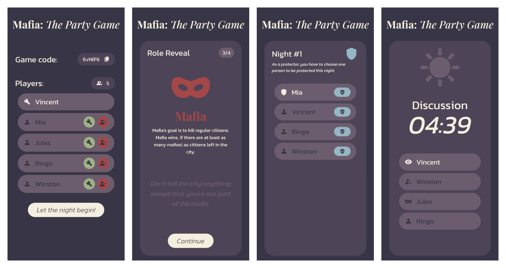

# Mafia: The Party Game
Web application for the party game Mafia (also known as Werewolf). Its purpose is to help the moderator, rather than replace their role completely.



## Purpose
When playing Mafia with friends, moderator might face some difficulties:
- Keeping track of roles and votes,
- Figuring out players' votes,
- Managing time for the discussion.

This application offers a solution to these problems.

Every player joins a lobby on their phone. Moderator manages the game through the website. Players can also see game progress on their devices and take actions during their turn, such as voting.

## Features
- **No registration necessary**: Just pick your username!
- **Lobby system**
  - **Game code**: Send your friends a simple 6-character game code,
  - **Change moderator**: Pass the moderator role with just a click.
- **Automatic role assignment**: Roles will be assigned automatically.
- **Role reveal event**: In random order, every player will be shown their role.
- **Wake up info**: Moderator knows exactly who to wake up.
- **Discovered roles**: Players that know the role of other players (mafiosos know about each other, seer chooses players to learn their team) see it on their phone.
- **Voting**: Players can vote on their phones.
- **Discussion timer**: Discussion timer automatically starts, moderator can extend or skip the discussion, if necessary.

## Mafia rules used in the game
- **Minimum 4 players and 1 moderator** are required to start a game.
- **A third of the players** (rounded down) will become mafiosi.
- **Other roles**:
  - **Protector**: Every night, Protector can choose one person that will be saved from death. 
  - **Seer**: Every night, Seer can learn one person’s team.
- Mafia **unanimously** chooses a person to kill.
- Protector can choose anyone **including themselves or the same person 2 times in a row**.
- Seer learns player's **team** (The Mafia or The Village), not their exact **role**. 
- When someone **dies** or **is voted out**, their role is **not revealed** to the players.
- To be voted out, player has to get **>50%** of the votes.
- You can skip day vote.
- If there is a **tie**, **no one** gets eliminated.
- The **mafia wins** if its members make up **50% or more** of the players.
- The **village wins**, it there are **no mafiosi left**.


## Technologies
Created with Django 5 and Svelte 4.

## Setup
### Frontend
```
cd frontend
```
Make sure, you have installed `npm`. For development use:
```
npm run dev
```
For release, you can use:
```
npm run build
```

### Backend
```
cd ../backend
```

I recommend using a virtual environment for the Django project. After you activate it, install dependencies:
```
pip install -r requirements.txt
```

Then create a database by applying the migration.
```
python manage.py migrate
```

You can also create a superuser.
```
python manage.py createsuperuser
```

To run the development server, use
```
python manage.py runserver
```

For release, it is recommended to use proper database for Django's models and Redis for Django Channels. Other release steps can be found in [Django's documentation](https://docs.djangoproject.com/en/5.0/howto/deployment/checklist/). 